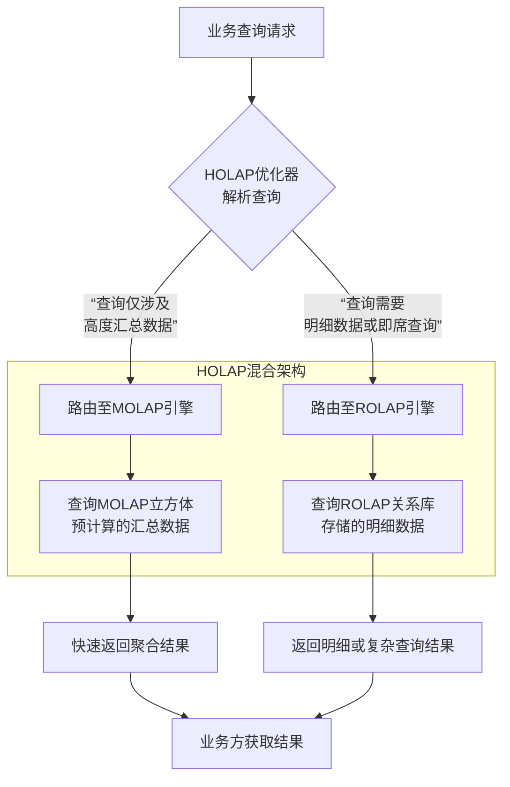

# 本质与定义
+ **定义**：联机分析处理，是一种用于支持复杂的分析查询，侧重**读**操作，为商业智能和决策支持提供快速、灵活、多维数据视图的软件技术。
+ 
+ **核心特征（FASMI）**：
    - **快速**：查询响应应在秒级或毫秒级。
    - **分析**：能支持复杂的计算、趋势分析和数据钻取。
    - **共享**：支持多用户并发访问。
    - **多维**：这是OLAP的灵魂，数据以**星型模型**或**雪花模型**等多维模型进行组织和观察。
    - **信息**：能够访问和提供所需的所有相关数据。

# 背景与动机
**为什么需要专门的OLAP数据库？**

1. **解决离线数仓的痛点**：
    - **高并发交互式查询**：Hive 适合处理ETL和批量复杂查询，但无法支持数百甚至数千用户同时进行秒级响应的**即席查询**。
    - **亚秒级/秒级响应**：业务用户（产品、运营、分析师）无法忍受分钟级的查询等待，需要“点击即得”的分析体验。
    - **实时分析需求**：传统T+1的离线数仓无法满足实时监控、实时BI、实时数据看板的需求。
2. **在大数据架构中的定位**：
    - OLAP数据库通常位于数据仓库的**最上层**，作为**数据服务层/应用层**。
    - **数据流向**：`数据源 -> ETL/实时计算 -> 数据湖/ODS -> 数仓（分层建模） -> OLAP数据库 -> BI工具/报表系统`。
    - 它承接了来自下游BI工具、报表系统、自助分析平台的高并发、低延迟查询压力，是数据价值的最终出口。

# 架构
## 核心组件
从底层至顶层

1. **数据集成与加工层**
    - 职责：负责从各个数据源抽取、清洗、转换并加载数据
    - 核心组件：ETL/ELT 工具，数据管道
    - 技术举例：Spark、Flink、Kafka 等
2. **数据存储层**
    - 职责：负责以最优的格式存储海量数据，为高效查询奠定基础
    - 核心组件：列式存储引擎
    - 技术举例：Parquet、ORC、内置于 OLAP 数据库中的列存引擎
3. **计算引擎层**
    - 职责：负责执行复杂的查询计算
    - 核心组件：MPP 架构，向量化执行引擎
    - 功能：分布式并行计算、向量化处理、查询优化
    - 技术举例：StarRocks、Doris、ClickHouse
4. **查询与接口层**
    - 职责：OLAP 系统与用户或应用程序交互的窗口
    - 核心组件：SQL 接口、OLAP 查询语言、API
    - 技术举例：MySQL协议兼容层、ODBC/JDBC驱动
5. **前端应用层**
    - 职责：最终呈现，直接面向最终用户
    - 核心组件：BI 工具、报表系统、数据可视化平台
    - 功能：交互式仪表盘、即席查询、数据可视化、钻取与切片
    - 技术举例：Tableau、Power BI

额外包含：**元数据管理层**

+ 职责：存储元数据
+ 功能：数据立方体定义、血缘、业务语义层、权限管理

## 运作机制
针对场景：用户能够以极快的速度，从海量数据中获取任意维度的分析洞察  
运作机制分为三个核心阶段

1. 数据准备（ETL与建模）
2. 查询处理（引擎工作）
3. 结果呈现（用户交互）

****

**第一阶段：数据准备**

1. 数据抽取与集成：从业务系统抽取原始数据，集中到数仓或数据湖的 ODS 层
2. 数据清洗与转换：到 DWD 层
3. 数据建模与加载：事实表、维度表，DWS 或 ADS 层
4. 数据优化存储：加载进入 OLAP 数据库

****

**第二阶段：查询处理**

1. 查询接收与解析：协调节点接收SQL查询，进行语法解析
2. 查询优化与规划：是否命中预聚合、生成分布式执行计划、选择最优算法
3. 分布式执行：向量化执行、局部计算、数据移动
4. 结果汇总与返回：结果返回给前端应用

****

**第三阶段：结果呈现与交互**

5. 可视化呈现：BI 工具
6. 交互式分析：无需 SQL，通过拖曳、点击进行 OLAP 典型操作

## 架构演进与分类
### MOLAP：多维 OLAP
#### (1) 定义
MOLAP：预计算的多维数据立方体，核心思想：**空间换时间**

+ 通过预计算所有可能的查询结果，并将其存储在一个高度优化的专用数据结构中，来换取极致的查询响应速度

MOLAP是一种OLAP实现方式，其中数据存储在一个专有的**多维数组**中，这个结构通常被称为**数据立方体**。

+ **多维数组**：想象一个巨大的N维空间（例如，3维：产品 x 时间 x 地域），空间中的每一个交点（单元格）都存储了预先聚合好的度量值（如销售额）。
+ **预计算**：在数据加载到MOLAP引擎时，系统会预先计算好各种维度组合（上卷）后的汇总数据。

#### (2) 工作流程
典型的MOLAP系统处理流程如下：

1. **数据提取**：从业务数据库、数据仓库等源系统抽取数据。
2. **构建多维立方体**：
    - **转换与加载**：将关系型的二维数据（事实表和维度表）转换为多维模型。
    - **预计算/预聚合**：这是最关键的步骤。系统会根据维度的层次结构，预先计算好所有可能的汇总组合。例如，预先算好`年-品类`、`季度-产品`、`月-城市`等无数种组合的销售额总和。
3. **存储**：将预计算的结果和多维数组索引存储在高性能的专有文件格式中。
4. **查询**：用户提交查询时，MOLAP引擎不再是进行大量的表连接和聚合计算，而是：
    - 将查询条件转换为多维坐标。
    - 通过索引直接定位到数组中的相应单元格。
    - 直接返回存储在该单元格中的预计算值。

#### (3) 代码
在MOLAP的整个流程中，代码主要分布在三个环节：

+ **立方体定义**：通过代码/配置告诉系统如何构建立方体。
    - 定义数据模型，包括来源表（事实表、维度表）、关联条件、聚合函数
    - 定义 Cube：定义参加预计算的维度、维度组合、度量计算方式
+ **构建（ETL）**：执行构建代码
+ **查询**：业务方通过标准SQL查询（事实表 join 维度表），底层自动路由到预计算结果。

#### (4) 优缺点
优点：

+ 极致查询性能：查询是直接的数组寻址，杂度是O(1)或近似O(1)，响应速度通常是**亚秒级**
+ 自动处理复杂计算：预计算方差、百分比、排名
+ 业务用户友好

缺点

+ 数据膨胀
+ 维度灾难：预计算的组合呈指数增长
+ 更新延迟高：预计算耗时
+ 灵活性不足：
    - 无法查询明细数据（通常只保留汇总后的数据）。
    - 如果查询条件不在预计算的维度组合内，要么无法回答，要么性能会退化为全表扫描。

#### (4) 常见 MOLAP 引擎
1. **Apache Kylin**：
    - **核心特点**：将MOLAP理念与Hadoop/BigQuery等大数据平台结合的典范。它使用Hive/Spar从源表读取数据，预计算的结果（Cube）存储在HBase/Parquet等存储中，对外提供标准SQL接口。
    - **适用场景**：适用于超大规模数据集（PB级）上对固定维度和指标的极速查询，如大型电商的报表平台。
2. **Apache Druid**：
    - **核心特点**：它是一个实时OLAP数据库，但其核心设计（列式存储、预聚合）深受MOLAP思想影响。它在数据摄入时就会进行部分预聚合（使用Roll-up功能），特别擅长处理时序事件数据。
    - **适用场景**：实时监控、APM、点击流分析等需要高吞吐实时写入和低延迟查询的场景。

### ROLAP：关系型 OLAP
#### (1) 定义
核心思想：现场计算，按需聚合

定义：一种 OLAP 的实现方式，

+ 数据存储在**关系型数据库**或**兼容关系模型的分布式系统**中，以事实表、维度表存在
+ 使用**标准的SQL**来执行查询和计算，查询来临时，通过强大的SQL引擎生成执行计划
+ 无需将数据存储在多维立方体中。

#### (2) 工作流程
当业务方提交一个查询时，ROLAP引擎内部的工作流程如下：

1. **SQL解析与优化**：引擎接收标准SQL，进行语法解析、语义分析，并基于表的统计信息（如基数、数据分布）生成一个最优的**分布式执行计划**。
2. **查询分发**：将执行计划拆分成多个子任务，分发到存储数据的各个节点上。
3. **并行处理**：每个节点在本地并行地扫描数据块（事实表和维度表），进行过滤、预聚合等操作。这是高性能的关键。
4. **数据Shuffle与汇总**：中间结果通过网络在不同节点间进行交换（Shuffle），特别是需要进行`JOIN`或全局`GROUP BY`时。
5. **最终聚合与返回**：所有中间结果汇集到少数节点或协调器进行最终聚合，将结果返回给客户端。

#### (3) 优缺点
优点

+ 灵活性极高：支持即席查询，任意组合维度和条件
+ 可处理海量明细数据
+ 数据更新实时性强：支持实时或准实时数据插入/更新。数据写入后立即可查，延迟可低至分钟级甚至秒级。
+ 无数据膨胀
+ 标准 SQL

缺点

+ 查询性能依赖优化：严重依赖于表设计（分区键、排序键）、索引策略、引擎优化器、硬件资源
+ 并发能力有挑战：复杂的即席查询会消耗大量CPU和内存资源
+ 查询响应时间有波动：速度取决于数据量和查询复杂度。

#### (4) 常见 ROLAP 引擎
1. **Apache Doris / StarRocks**
    - **核心特点**：新一代极速全场景MPP数据库。采用全面向量化执行引擎，CBO优化器非常强大。对标准SQL和MySQL协议兼容性极佳。
    - **优势**：高并发查询性能极佳，兼顾简单查询和复杂查询，易用性好。
2. **ClickHouse**：
    - **核心特点**：为**单表大数据聚合查询**而生的列式数据库。其`MergeTree`引擎配合稀疏索引，在宽表聚合场景下性能达到极致。
    - **优势**：无与伦比的压缩比和单表查询性能。适合日志、事件分析等逆规范化宽表场景。
3. **Apache Druid**：
    - **核心特点**：虽然常被归类为MOLAP或混合架构，但其查询接口是SQL，可视为一种特殊的ROLAP。特别擅长处理时序数据的实时摄入与快速聚合。
    - **优势**：高吞吐实时数据摄入和稳定的查询延迟。
4. **Presto/Trino**：
    - **核心特点**：是一个**分布式SQL查询引擎**，而非数据库。它不存储数据，而是通过连接器查询HDFS、S3、HBase等底层数据源。
    - **优势**：联邦查询能力，可以同时查询多个不同数据源。适合即席查询和数据湖分析。

#### (5) 注意事项
1. 特别注意数据模型设计：分区键、排序键，优先使用星型模型，减少 Join 深度
2. 索引策略
3. 与现有架构集成

### HOLAP：混合OLAP
#### (1) 定义
将MOLAP和ROLAP的优势结合起来。扬长避短，分层治理

+ 用**MOLAP**处理需要**极致速度的、固定的、高度汇总的**查询。
+ 用**ROLAP**处理需要**灵活的、涉及明细数据的、即席的**查询。

HOLAP是一种混合架构，它在物理存储和逻辑处理上同时结合了MOLAP和ROLAP两种技术。通常，它将**汇总数据**存储在专有的**多维立方体**中，而将**明细数据**保留在**关系型数据库**中。

**HOLAP不仅仅是一种具体的数据库技术，更是一种重要的架构思想**。它的精髓在于认识到没有一种技术是万能的，并通过组合的方式达到最佳效果。

#### (2) HOLAP 工作流程

存储层

+ MOLAP 存储：存储预计算好的各种维度的聚合数据，
+ ROLAP 存储：存储原始的事实表和维度表

查询处理层

+ 接收查询请求
+ 智能路由器：解析SQL查询。判断该查询是可以通过访问MOLAP立方体直接满足，还是必须下推到ROLAP存储去扫描明细数据。
+ 执行与合并

#### (3) 优缺点
优点：

+ 平衡性能与灵活性
+ 合理的存储开销
+ 支持明细下钻

缺点

+ 架构复杂
+ 数据一致性挑战
+ 查询路由并非万能：如果路由错误，查询性能极差

#### (4) 常见的实现方式
1. **数据库内 HOLAP 支持**：一些商业数据库（如Microsoft Analysis Services）直接提供了HOLAP存储模式。在创建立方体时，你可以选择存储模式为HOLAP，数据库会自动管理汇总数据和明细数据。
2. **应用层 HOLAP**：现代高性能ROLAP引擎（如StarRocks、Doris）通过其智能物化视图功能，本质上已经实现了HOLAP的核心价值

## 关键技术模型：多维数据模型
建设离线/实时数仓时，**明细层**和**汇总层**的表设计，本质上就是在实现多维模型。

**事实表**

+ 内容：主键、度量
+ 类型：事务事实表、周期快照事实表、累积快照事实表  
**维度表**
+ 内容：描述性信息
+ 核心概念：层次结构，维度内部存在的自然层级关系，允许用户从不同粒度观察数据。支持**钻取**操作（上卷和下钻）。

**事实与维度的组织方式**

+ 星型模式
    - 大事实表在中心，周围连接多个维度表，维度表没有进一步规范化
    - 优点：简化查询，Join 少，性能高
+ 雪花模式
    - 星型变体，维度表被规范化成多张表，一部分维度表不直接与事实表相连
    - 优点：减少冗余，省空间，符合数据库范式
    - 缺点：查询复杂，用户不友好
+ 星座模式
    - 多个事实表共享相同的维度表
    - 最常见模式
    - 便于进行跨业务过程分析

**与多维模型交互**：OLAP 查询的灵魂

+ 钻取
    - 上卷：细粒度向高粒度汇总
    - 下钻：查看更详细的数据
+ 切片：在某个维度上选择一个特定值，在剩余维度上观察数据
+ 切块：在某个维度上选择一定区间的值，在剩余维度上观察数据，可以看作切片的集合
+ 旋转：改变维度的方向，将行列维度进行互换，并不改变数据本身，只改变数据的展示方式

模型设计流程：识别业务过程 -> 声明粒度 -> 确定维度 -> 确定事实。

**涉及概念**

+ **基数**：维度字段去重后的值个数。高基数列（如用户ID）和低基数列（如性别）需要不同的处理策略

# 技术原理
## 列式存储
### 为什么引入列式存储
与行式存储最根本的差异：**数据组织的顺序**。

+ **行式存储**：按**记录**组织数据。将一行中所有列的值连续存储在一起。
    - **优势**：适合频繁的增删改操作和需要读取整行数据的OLTP场景。
+ **列式存储**：按**列**组织数据。将每一列的所有值连续存储在一起。
    - `[Column ID: (1, 2, 3, ...)], [Column Name: (A, B, C, ...)], [Column Age: (20, 30, 25, ...)], ...`
    - **优势**：为OLAP场景中常见的、只涉及少数列的查询而优化。

**为什么列式存储适合 OLAP**

+ OLAP 的查询模式具有以下几个特点
    - 每次查询只涉及少数列，通常只关心少数几个维度和度量
    - 数据批量读取：分析扫描需要大量数据
    - 重度聚合：大量 GROUP BY
+ 列式存储的优势
    - 对少数列，IO 总量大幅减少，极高 IO 效率
    - 极佳的数据压缩率：
        * 同一列数据：数据类型一致，相关性高
        * 压缩算法：字典编码，行程编码，位图编码
    - 更好的向量化执行：CPU 向量化指令可同时对多个数据执行同一操作。列式存储将一列数据连续存放，非常适合批量加载到CPU缓存，进行并行计算
    - 更适合延迟物化： **“物化”指将数据记录完整组合起来**。在列存中，先对列进行一系列处理，最后一步再返回。这减少了中间结果的数据量。

### 技术实现
**Apache Parquet / Apache ORC**

+ 定位：列式存储，用于数据湖上的持久化存储
+ 特点：
    - 将数据划分为多个**行组**，每个行组内按列存储。
    - 包含丰富的**元数据**（如每列的最大/最小值）和**索引**，便于查询引擎快速跳过不相关的数据块。  
**ClickHouse**
+ 定位：原生列式数据库
+ 特点：
    - `MergeTree`引擎：数据按**主键（排序键）** 排序后存储，便于范围查询。
    - 每个列都是一个独立的`.bin`文件，配有索引文件（`.mrk`）。
    - 查询时，能利用排序信息快速定位数据块，并仅加载所需的列。  
**StarRocks / Apache Doris**
+ 定位：原生列式 MPP 数据库
+ 特点
    - 数据在存储时按列组织和编码。
    - 与向量化执行引擎深度集成，实现极致性能。
    - 支持更实时的更新和删除操作。

### 列式存储的挑战与应对策略
+ 点查询（按key查询）效率低
    - OLAP 场景不常见
    - 使用索引：为常用的查询键创建索引
+ 数据加载与更新成本高：插入一行新数据，需要追加到每个列文件的末尾，I/O被放大（多次写入）。
    - 批量写入：先写入内存缓冲区，再批量、有序刷入磁盘
    - 限制更新：列式数据仓库更倾向于追加（Append-only），更新通过标记删除和新增版本实现

## 压缩算法
压缩算法主要针对的是列式存储的，算法分为两大类：

+ **专为列存设计的轻量级编码**：第一步，实际是高效编码
+ 通用压缩算法：第二步

### 轻量级编码（Lightweight Encoding）
+ **字典编码（Dictionary Encoding）**
    - 原理：将列中所有不重复的值（唯一值）提取出来排序，形成一个字典（`值 -> 字典ID`），然后用更紧凑的字典ID（通常是整数）替换原始值。
    - 适用场景：低基数（唯一值少）的列，如`城市名`、`国家`、`性别`、`状态码`等字符串类型的维度列。
    - 优势：极大压缩（整数值代替长字符串），计算友好（整数ID），可作为索引
+ **行程编码（Run-Length Encoding, RLE）**
    - **原理**：将连续重复出现的值压缩为一个三元组：`(值, 起始位置, 运行长度)`或简单的`(值, 出现次数)`。
    - **适用场景**：数据排序后，**连续重复值多**的列。在列存中，如果数据按`日期`等列排序，那么`日期`、`品类`等列就会产生大量连续重复值。
    - 优势：
        * 极致压缩比（排序后的数据）
        * 加速计算：针对（值，次数）进行聚合计算
+ **位图编码（Bitmap Encoding）**
    - **原理**：为列中的每个唯一值创建一个位图（bitmap）。位图的长度等于总行数。如果某一行是该值，则对应位置为1，否则为0。
    - 适用场景：**基数极低**的列，如`布尔值`、`性别`、`是否激活`等。是字典编码的一种补充和高效实现方式。
    - 优势：快速条件过滤，高效计算基数（count(distinct)）
+ **增量编码/前缀编码（Delta / Prefix Encoding）**
    - **原理**：不存储原始值，而是存储与上一个值的差值（Delta）或共同的前缀。
        * **增量编码（用于数值/时间戳）**：第一个存基准值，后面存的是差值
        * **前缀编码（用于字符串）**：提取共同前缀，只存储差异部分
    - **适用场景**：排序后连续值差异很小的列，如**自增ID**、**时间序列数据**、**有序的字符串**。
    - **优势**：将数据转换为更小的数值，为后续的通用压缩算法（如LZ4）创造更好的条件。
+ **帧间压缩（Frame Of Reference, FOR）**
    - **原理**：适用于数值列。找一个基准值（如块内最小值），然后存储每个值与这个基准值的差值。这些差值通常比原始值小得多，可以用更少的比特位表示。
    - **适用场景**：数值范围波动不大的整数列

### 通用压缩算法（General-Purpose Compression）
当数据经过上述轻量级编码后，已经变得“更规整、更重复”。此时再应用通用压缩算法，可以达到最佳效果。这些算法负责“最后的压缩”，但通常需要先解压才能进行计算。

+ **LZ4 / Snappy**
    - **特点**：**追求速度**。压缩/解压速度极快，但压缩比中等。
    - **应用**：常用于**热数据**或**中间计算数据**的压缩，因为速度优先对查询性能至关重要。
+  **Zstandard (Zstd)**
    - **特点**：**速度与压缩比的优秀平衡**。在提供接近LZ4速度的同时，能达到接近Gzip的压缩比。
    - **应用**：越来越受欢迎，是许多新一代系统的默认选择
+ **GZIP / DEFLATE**
    - **特点**：**追求压缩比**。压缩率很高，但压缩和解压速度较慢，消耗更多CPU。
    - **应用**：适用于**冷数据**存储，对存储成本敏感，但对查询延迟要求不高的场景。

### 启示
+ 理解schema设计的影响：**表结构设计直接影响压缩效率**。例如，将`region`字段设计为`‘华东’`而不是编号`1`，看起来浪费空间，但经过字典编码后，查询性能和存储效率可能更高。
+ **排序键的重要性**：在创建表时，选择合适的排序键，能使相同值在物理上连续存储，从而**极大提升RLE等编码的效率**

## 索引技术
### 简介
OLAP 索引与 OLTP 索引的根本区别

+ OLTP 索引（比如 B-Tree）
    - **目标**：快速定位**单条或少量**记录（点查询、范围查询）。
    - **特点**：优化随机读写，维护成本高（影响写入速度）。
+ OLAP 索引
    - **目标**：快速**排除**大量不相关的数据块，减少需要扫描的数据量。
    - **特点**：面向**批量读取**，追求**高吞吐**而非低延迟点查，对写入友好。

OLAP索引的本质是**数据跳过**，即“用元数据来避免读取完整的数据块”

### OLAP 索引的分类与技术原理
OLAP索引分为两大类：

+ **轻量级元数据索引**：几乎所有列存OLAP引擎都具备
+ **专用数据结构索引**：要创建额外的数据结构来加速查询

#### (1) 轻量级元数据索引
+ **min/max索引（Zone Maps）**
    - **原理**：为每个数据块（或行组）记录其内部某列的最小值和最大值
    - **优势**：实现极其简单，开销极小，对排序后的数据效果极佳
+ **基数索引（Cardinality Index）**
    - **原理**：记录每个数据块中某列的唯一值个数。
    - **优势**：可辅助优化`IS NULL`、`DISTINCT`等查询。
+ **空值索引（Null Index）**
    - **原理**：记录每个数据块中某列是否包含NULL值。

#### (2) 专用数据结构索引
+ **位图索引（Bitmap Index）**
    - **原理**：针对去重后的列值，每个列值创建一个位图（bitmap）。位图长度等于总行数，如果某行等于该值，则对应位为1，否则为0。
    - **优势**：
        * 对索引列做过滤，无需扫描数据文件
        * **多列过滤极快**：对两个列值的位图做AND操作
        * 实际存储时，位图会使用**行程编码（RLE）**压缩，压缩比极高
    - **缺点**：
        * **仅适用于低基数列**
        * 更新成本高。
        * 位图擅长等值查询（`=`），但对`>`、`<`等范围查询无能为力
    - **适用场景**：性别、状态、省份等低基数的维度列。
+ **倒排索引（Inverted Index）**
    - **原理**：为文本内容中的每个词（Token）建立一个映射，记录包含该词的所有行ID列表。这其实就是搜索引擎的核心技术。
    - **优势**：实现文本的快速全文搜索
    - **OLAP中的应用**：在Doris、ClickHouse中用于加速字符串类型的等值、LIKE查询。
+ **布隆过滤器（Bloom Filter）**
    - **原理**：一种概率型数据结构，用于**快速判断一个元素“绝对不存在”于一个集合中**。
    - **优势**：存储空间极小，远超min/max的过滤能力，特别适合**高基数列**的等值查询。
    - **适用场景**：`user_id`, `order_id`等唯一标识符的过滤。

## 预聚合
### 核心思想
核心理念：用空间换时间，以预计算换实时性能  
在数据写入阶段，提前计算好可能被频繁查询的汇总结果，并将这些结果存储下来。当查询到来时，直接返回预计算的结果，避免实时扫描大量原始数据进行计算

### 技术实现方式
显式&隐式，手动&自动

+ 手动聚合：汇总表，这是最基础、最灵活的方式
    - **原理**：通过ETL任务，定期执行聚合SQL，将结果存入一张新的“汇总表”
    - **优点**：简单、通用，所有SQL引擎都支持。
    - **缺点**：需要手动维护ETL任务，数据延迟较高（通常T+1）。
+ 物化视图（Materialized View）：手动的升级版本，数据库自动维护
    - **原理**：物化视图看起来像一个视图，但实际上是**存储了查询结果的物理表**。数据库会自动、增量地维护这个结果集，使其与基础表保持同步。
    - **查询**：业务方**不需要改变查询语句**，仍然查询原始明细表
    - **智能路由**：OLAP引擎的优化器会自动识别这个查询可以被物化视图满足，从而**重写查询计划**，直接从物化视图中读取，而不是扫描原始表
    - 优点：对应用透明（业务代码无需修改），自动维护，提升性能（扫描原始表->直接读数）
+ MOLAP Cube：极致的预聚合
    - **原理**：根据定义好的所有维度组合，**预先计算所有可能的聚合结果**，并将其存储在一个多维立方体中
    - **优点**：查询速度极快，是亚秒级响应的保证。
    - 缺点：维度灾难，不灵活，更新延迟

### 4.3.3 预聚合的优缺点分析
**优点**

+ 查询性能提升
+ 降低集群计算压力
+ 提升并发能力  
**缺点**
+ 存储成本增加
+ 数据延迟：预聚合需要时间
+ 灵活性首先
+ 维护困难

## 4.4 向量化执行引擎
### 4.4.1 核心思想与引入背景
核心理念：从一次一行，到一次一批

**传统执行模型：火山模型（Volcano Model）/迭代器模型**

+ 工作原理：传统数据库和早期Hive/Spark使用的模型。
    - 查询计划由多个算子组成
    - 执行时，每次由根节点向上游算子请求“下一行”数据
    - 数据像“拉”动一样，一行行地流过整个执行树
+ 缺点：
    - 虚函数调用开销大（`next()`)，现代CPU指令流水线被频繁打断
    - 无法利用CPU缓存，数据访问是随机的
    - **无法利用现代CPU的SIMD指令**：SIMD要求对连续的多条数据执行相同操作，一行数据无法满足。

**向量化模型（Vectorized Model）**

+ 工作原理：**每次处理一批数据（比如1024行），而不是一行**。这批数据称为一个“向量”。
    - 每个算子的`next()`方法返回的不再是一个元组，而是一个**批次的元组**。
    - 数据以列式的形式在算子之间传递。

### 4.4.2 为什么向量化能极大提升性能？
+ 大幅减少虚函数调用：CPU可以将更多时间用于实际计算而非调度。
    - 传统模型：N行数据，调用N次`next()`
    - 向量化模型：批次处理，一批次M条（M可设为1024），调用 N/M 次`next()`
+ 极致利用CPU缓存
    - 数据按列存储，并且以批次方式处理，当CPU需要计算某列时，可以将连续内存中的一整个批次的值加载到高速缓存中，后续的加法操作可以一直在高速缓存中完成，避免了频繁从主存获取数据的瓶颈
+ **解锁CPU的SMID指令集（最关键优势）**
    - **SIMD**：单指令多数据流。允许CPU**用一个指令同时处理多个数据**。
+ 有利于编译器优化：处理循环批次时，代码是紧凑的循环结构，编译器更容易进行循环展开、寄存器优化等底层优化。

### 4.4.3 优势与挑战
**优势：**

+ 性能提升巨大：尤其在数值计算密集的OLAP场景，性能提升5-10倍很常见。
+ 更好地利用硬件：充分发挥现代CPU的并行计算能力。  
**挑战**
+ 实现复杂度高：需要重写所有数据库执行算子，工程门槛高。
+ 并非万能：对于字符串处理等操作，SIMD优势不明显。
+ 批次大小需要权衡：批次太小，优化效果不佳；批次太大，可能增加延迟并占用更多内存。

## 4.5 MPP 架构
### 4.5.1 核心思想
MPP：**Massively Parallel Processing**，大规模并行处理

MPP的核心思想：分而治之，并行计算

+ 将一个大任务拆分成许多小任务
+ 分配到多个独立的计算节点上并行执行
+ 然后将各节点的中间结果汇总起来得到最终答案

### 4.5.2 核心组件
一个典型的MPP数据库集群由以下两种节点组成：

+ **协调节点**
    - **职责**：接收客户端查询，解析SQL，生成分布式执行计划，将计划分发给数据节点，最终汇总结果返回给客户端。
    - **特点**：通常是无状态的，可以部署多个以实现高可用。**它不存储用户数据**。
+ **数据节点**
    - **职责**：实际存储数据，接收协调节点分发的子任务，在本地并行执行计算，并将中间结果返回给协调节点或其它数据节点
    - **特点**：每个节点配备独立的CPU、内存和磁盘。节点间通过高速网络互联

### 4.5.3 运行机制
**阶段一：并行扫描和本地聚合**

1. **任务分发**：协调节点将查询计划发给多个数据节点。
2. **本地计算**：每个节点**并行地**扫描本地存储的数据，并进行计算
3. **产生中间结果**：每个节点都计算出一份本地中间结果

**阶段二：数据重分布与全局聚合**

1. **数据Shuffle**：需要将**相同Region的数据发送到同一个节点**进行最终聚合。这是一个网络传输过程。
2. **最终聚合**
3. **结果返回**：协调节点从各个节点收集最终结果，返回给客户端

### 4.5.4 关键特征
+ **Shared-Nothing架构**
    - 这是MPP的灵魂。每个数据节点都有自己的CPU、内存和磁盘，不共享任何资源。
    - **优势**：极强的扩展性。要提升系统能力，只需简单地增加节点即可（线性扩展）。无资源竞争瓶颈。
    - **对比**：`Shared-Disk`架构（如Oracle RAC）所有节点共享同一存储，容易产生IO瓶颈。
+ **数据分布策略**：数据如何在节点间分布，直接影响查询性能。主要策略有：
    - **哈希分布**：根据某一列的哈希值决定数据存放在哪个节点。这是最常用的方式，能保证数据均匀分布，并使得`GROUP BY`该列的查询无需全局Shuffle。
    - **随机分布**：数据随机打散到所有节点。保证均匀性，但多数查询都需要Shuffle。
    - **范围分布**：按某一列的值范围分布。可能导致数据倾斜。
+ **查询优化器**：MPP的优化器比单机数据库复杂得多，它必须是**代价优化器**，需要考虑：
    - 数据在不同节点上的分布情况。    
    - 网络传输的成本。
    - 选择最优的`JOIN`顺序和算法（如 Broadcast Join 还是 Shuffle Join）

### 4.5.5 优势与挑战
  
**优势：**

1. **高性能**：通过并行处理，将任务分解，极大缩短查询时间。    
2. **高扩展性**：理论上可以通过增加节点线性提升系统处理能力。
3. **高可用性**：部分节点故障不影响整个系统运行（其他节点可以接管其任务）。  
**挑战：**
4. **数据倾斜问题**
5. **网络瓶颈**：节点间的数据交换（Shuffle）会带来巨大的网络开销。网络带宽和延迟可能成为瓶颈。
6. **复杂度高**：系统架构、运维和调优都比单机数据库复杂。

# 5. 主流引擎对比与选型
## 5.1 主流引擎对比
| 引擎 | 核心架构 | 核心优势 | 短板 | 最佳适用场景 |
| --- | --- | --- | --- | --- |
| **StarRocks / Apache Doris** | MPP + 列式 + 向量化 | **极速**（尤其多表关联）、标准SQL兼容性好、易运维（架构简单）、支持实时更新 | 社区和生态相对较新，仍在快速发展 | **高并发、复杂即席查询**的企业级BI、实时数仓 **（“万金油”）** |
| **ClickHouse** | MPP + 列式 | **单表聚合性能极致**、压缩比极高、适合时序/日志数据 | 多表JOIN能力较弱、分布式配置复杂 | **日志/行为分析**、**时序数据**、单表巨量数据聚合 |
| **Apache Druid** | 分布式 + 列式 + 预聚合 | **高吞吐实时摄入**、查询稳定性高、擅长时序和事件流 | 数据模型灵活性较差（偏向星型模型）、SQL支持较弱（在增强） | **实时事件流分析**（如APM、广告监控）、时序场景 |
| **Trino/Presto** | MPP **查询引擎** | **联邦查询**（跨多种数据源）、生态丰富、标准SQL | **不存储数据**，性能依赖底层存储（如HDFS），并发能力较弱 | **即席查询**、**数据湖查询**、跨源数据探索 |
| **Apache Kylin** | MOLAP（预计算） | **超大规模聚合查询极快**（亚秒级）、高并发 | 灵活性差（维度固定）、预计算耗时、数据延迟高 | 固定维度/metrics的超高并发查询（如大型电商报表） |

## 5.2 深入对比与阵营划分
将主流 OLAP 引擎划分为三大阵营

+ 原生分布式 OLAP 数据库（主打性能）
+ 联邦查询引擎（主打灵活性）
+ 预计算引擎（主打并发与延迟）

**原生分布式 OLAP 数据库**（主打性能）

+ **特点**：自己管理存储和计算，专为OLAP设计，性能极致。
+ **StarRocks/Doris**： **平衡型选手**。在性能、易用性、功能（如实时更新、物化视图）上做到了很好的权衡，目标是**企业级统一OLAP平台**
+ **ClickHouse**： **特长生**。在单表查询上天下无敌，但其他方面有明显短板。适合日志、事件分析等特定领域
+ **Apache Druid**： **实时流处理专家**。为高吞吐、低延迟的数据摄入和查询而优化，适合**实时监控**  
**联邦查询引擎**（主打灵活性）
+ **特点**：不存储数据，是“计算”与“存储”分离的典范
+ **Trino/Presto**： 适合**数据探索**。可以同时查询Hive、MySQL、Kafka、Redis等，非常适合数据湖架构和即席数据探索。但性能不如原生OLAP数据库。  
**预计算引擎**（主打并发与延迟）
+ **特点**：用预计算换查询性能，适合极度稳定的业务场景。
+ **Apache Kylin**： **报表加速器**。在数据模型固定、查询模式固定的超高并发场景下，性能无可匹敌。但极其不灵活

## 5.3 OLAP 引擎选型方案
四步决策法  
**第1步：明确业务场景与查询模式（最重要！）**

+ 这个 OLAP 系统主要用来做什么？有以下 5 种场景
    - 企业级 BI 与即席查询
        * 特征：业务人员拖拽报表，查询条件灵活多变，多表关联非常普遍。
        * 候选：StarRocks/Doris、Trino（如果数据在数据湖）。
    - 日志/行为/时序数据分析：
        * 特征：数据量大，写入吞吐高，查询主要是对单张巨表的过滤和聚合，很少关联。
        * 候选：ClickHouse、Druid
    - 实时监控与事件流分析
        * 特征：需要实时看到流式数据（如点击流、APP性能数据）的聚合结果
        * 候选：Druid、StarRocks、ClickHouse
    - 固定报表与超高并发
        * 特征：报表样式固定，但需要应对成千上万的用户同时访问
        * 候选：Apache Kylin
    - 数据湖探索与跨源查询
        * 特征：数据存放在HDFS/S3上，需要灵活地探索数据，或需要关联MySQL等外部数据源。
        * 候选：Trino/Presto

**第2步：评估技术约束与团队能力**

+ 运维复杂度
    - 简单：StarRocks/Doris > Kylin > Trino > Druid > ClickHouse
    - ClickHouse的分布式配置和ZooKeeper依赖较为复杂
+ 团队技术栈
    - 熟悉Java生态：Druid、Kylin、Trino会更顺手
    - 熟悉C++生态：ClickHouse、StarRocks更容易上手
+ SQL 兼容性
    - StarRocks/Doris、Trino 完全兼容MySQL或ANSI SQL  
**第3步：进行概念验证（PoC）**：实际测试，准备典型数据集和查询方案，测试重点：
4. 数据导入：体验数据导入的便捷性和速度。
5. 核心查询性能：执行典型查询，对比响应时间。
6. 并发能力：使用类似Apache JMeter的工具模拟多用户并发，看系统响应时间和稳定性。
7. 系统监控：检查系统的监控指标是否完善，便于日后运维。  
**第4步：评估社区与生态**
+ 社区活跃度
+ 商业支持
+ 生态系统：与现有数据平台（如Kafka、Spark、Flink、BI工具）的集成是否顺畅

对于大多数寻求构建现代数据栈的公司，

+ **通常会优先推荐从 StarRocks / Apache Doris 开始评估**。因为它在性能、功能、易用性上取得了最佳平衡，能覆盖最广泛的场景，降低了技术和运维风险。
+ 如果业务场景非常特定（如纯日志分析），再转向 ClickHouse 或 Druid 这样的特化引擎。
